

# DropSendTo 詳細設計書

- [Overview](#1-overview)
- [Index](#2-index)
- [3. Purpose](#3-purpose)
- [4. Audience and Reading Guide](#4-audience-and-reading-guide)
- [5. Scope](#5-scope)
- [6. Architecture Overview](#6-architecture-overview)
- [7. Module Detailed Design](#7-module-detailed-design)
- [8. Module Coverage Matrix](#8-module-coverage-matrix)
- [9. Deep Dive](#9-deep-dive)
- [10. Data Design](#10-data-design)
- [11. Control Flow and Sequence](#11-control-flow-and-sequence)
- [12. Error Handling and Resilience](#12-error-handling-and-resilience)
- [13. Security and Operations](#13-security-and-operations)
- [14. Test Strategy](#14-test-strategy)
- [15. Trade-offs and Future Extension](#15-trade-offs-and-future-extension)
- [16. Traceability](#16-traceability)
- [17. Open Questions](#17-open-questions)

## 1. Overview

DropSendTo は .NET 10 / WPF で実装された Windows 常駐ランチャーである。スロットグリッド、レイヤー、ドラッグアンドドロップ、CLI 引数、Prefix ショートカット、マクロ実行、検索レイヤー、タスクトレイ常駐、暗号化設定転送を単一プロセス内で扱う。

この詳細設計書は、既存の `docs/DESIGN.md` が示す全体設計を、実装モジュール単位の責務・入出力・失敗時挙動へ展開する。設計根拠は `src/DropSendTo` 配下の実装、`tests/DropSendTo.Tests` 配下のテスト、`docs/REQUIREMENTS.md` / `docs/SPEC.md` / `docs/DESIGN.md` / `docs/TESTPLAN.md` とする。

図の選定理由:
- コンポーネント図: UI、サービス、Win32/WPF/ファイル境界が複数あるため。
- 状態遷移図: Prefix armed、マクロ並行モード、ドロップ保留状態など 3 段階以上の状態を持つため。
- シーケンス図: CLI、クリック/ドロップ、Macro Script 拡張、検索起動は複数サービスが非同期協調するため。
- クラス図/ER 風図: `AppConfig` / `Layer` / `SlotModel` とサービス依存の理解が変更影響に直結するため。

[[↑ Back to Top]](#top)

## 2. Index

最短で把握したい場合は、次の順に読む。

1. 初見読者: [Architecture Overview](#6-architecture-overview) → [Control Flow and Sequence](#11-control-flow-and-sequence) → [Data Design](#10-data-design)
2. 既存開発者: [Module Detailed Design](#7-module-detailed-design) → [Deep Dive](#9-deep-dive) → [Test Strategy](#14-test-strategy)
3. AI エージェント: [Module Coverage Matrix](#8-module-coverage-matrix) → [Traceability](#16-traceability) → 対象モジュールの詳細節

用語:
- Slot: 1 つのランチャー登録単位。`SlotModel` で永続化される。
- Layer: スロット集合。`AppConfig.Layers` 内の `Layer`。
- Prefix: グローバルショートカットの導入キー。既定は `CTRL+Q`。
- Pending Drop: DropCaptureWindow で受けたパスを、後続クリック/検索/キーボード実行へ渡す一時状態。
- Macro Script 拡張: マクロ内の `COMMAND` 命令から登録済みコマンドを起動できるモード。

[[↑ Back to Top]](#top)

## 3. Purpose

目的:
- DropSendTo の実装構造を、今後の機能追加・保守・レビューで参照できる粒度に整理する。
- 主要モジュールの責務、公開インターフェース、入出力、内部ロジック、依存、失敗時挙動を明示する。
- マクロ、ショートカット、設定移行、検索、ドロップキャプチャのような読みづらい箇所を重点的に説明する。

作成日: 2026-05-20

対象ブランチ/コミット: 作業時点のワークツリー。正確なコミット固定が必要な場合は、この文書更新と同じコミットを参照する。

[[↑ Back to Top]](#top)

## 4. Audience and Reading Guide

AI 向けには、章見出しを固定し、モジュール表とカバレッジ表を置く。変更対象を探す場合は [Module Coverage Matrix](#8-module-coverage-matrix) から該当ファイルを特定し、[Deep Dive](#9-deep-dive) で状態管理上の注意点を確認する。

既存開発者向けには、`MainWindow.xaml.cs` が担う UI 統合責務と、サービスへ委譲済みの純粋処理の境界を強調する。Config 項目を変更する場合は、`ConfigService` と `ConfigTransferService` とテストの三点更新が必須である。

初見読者向けには、まず「常駐 WPF アプリが、スロット設定を読み込み、クリック/ドロップ/ショートカットから同じ起動パイプラインへ流す」と捉えると読みやすい。マクロは通常起動とは別に、直前の外部ウィンドウへ Win32 入力を送るサブシステムである。

[[↑ Back to Top]](#top)

## 5. Scope

対象:
- WPF アプリ本体: `src/DropSendTo`
- ユニット/統合テスト: `tests/DropSendTo.Tests`
- SDD 文書: `docs/REQUIREMENTS.md`, `docs/SPEC.md`, `docs/DESIGN.md`, `docs/TESTPLAN.md`
- 配布/検証スクリプト: `scripts/Run-Tests-And-Build.ps1`, `scripts/Build-Release.ps1`

非対象:
- 実行時ユーザー設定ファイルそのもの: `%AppData%/DropSendTo/config.json`
- 配布成果物: `dist/`
- 未実装の専用メトリクス基盤
- 外部アプリ側のフォーカス/入力受理挙動

外部境界:
- Windows / WPF / Win32 API: ウィンドウ、フック、SendInput、クリップボード、モニター DPI、WLAN API。
- ファイルシステム: `%AppData%/DropSendTo` の設定とログ、ユーザーが登録するコマンド/ディレクトリ。
- OS プロセス起動: `Process.Start` と `UseShellExecute=true`。

[[↑ Back to Top]](#top)

## 6. Architecture Overview

Fact: アプリは `App.OnStartup` から開始し、単一インスタンス取得、ログ初期化、設定ロード、CLI 起動処理、UI 起動へ進む。UI 起動後は `MainWindow` が表示状態、スロット描画、イベント接続を統括し、計算可能な処理はサービスへ委譲する。

Rationale: WPF 画面と Win32 フックは UI スレッドやウィンドウハンドルに強く依存するため、`MainWindow` を統合点に置く。一方で、検索、引数展開、キー解析、設定正規化などはテスト容易性を優先してサービス化している。

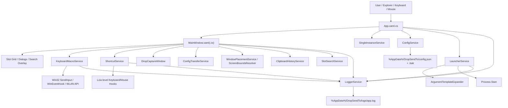

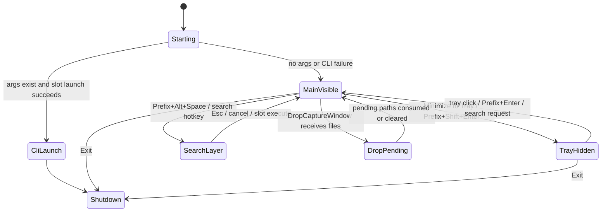

読み方: 上段はプロセス全体のライフサイクル、下段は実行中の主要 UI 状態である。検索レイヤーと Pending Drop は一時表示/一時入力として扱い、固定位置保存を上書きしない。

[[↑ Back to Top]](#top)

## 7. Module Detailed Design

### 7.1 App

- Responsibility: 起動入口、単一インスタンス制御、未処理例外ハンドラ、初期設定ロード、CLI 起動、メインウィンドウ表示、終了時リソース解放。
- Public Interface: `OnStartup(StartupEventArgs)`, `OnExit(ExitEventArgs)`。
- Inputs / Outputs: 入力はコマンドライン引数と実行環境。出力は UI 表示、または CLI 起動成功時の即時終了。
- Internal Logic: `SingleInstanceService` で多重起動を抑止し、`ConfigService.LoadOrCreate()` で設定を得る。CLI 引数があれば現在レイヤーの最初の登録済みスロット、なければ全レイヤー最初の登録済みスロットを `LauncherService` に渡す。
- Dependencies: `ConfigService`, `LauncherService`, `LoggerService`, `ThemeService`, `SingleInstanceService`, `HorizontalMouseWheelService`。
- Failure Modes: 設定ロード失敗はログ化し UI 起動へ継続する。CLI 起動失敗は MessageBox とログで通知し、手動操作のため UI を表示する。

### 7.2 MainWindow

- Responsibility: スロットグリッド描画、レイヤー/検索/ドロップ/トレイ/メニュー/ダイアログの統合、ショートカットイベントのアプリ操作への変換、スロット実行フローの統括。
- Public Interface: WPF ウィンドウイベント、`TriggerSlotAsync` 系の内部実行パイプライン、ショートカット/ドロップ/検索イベントハンドラ。
- Inputs / Outputs: 入力は UI イベント、ドロップパス、ショートカットイベント、検索文字列、設定ダイアログ結果。出力は UI 再描画、設定保存、マクロ/コマンド実行、トレイ状態変更。
- Internal Logic: 起動時に `ApplySlotLayout()` で行列分のスロット UI を生成し、`OnSourceInitialized` で Win32 ハンドル依存サービスを初期化する。スロット実行は `SlotTriggerKind` ごとに pending drop を消費し、実行モードに応じて `KeyboardMacroService` と `LauncherService` を呼び分ける。
- Dependencies: ほぼ全サービス。特に `ConfigService`, `KeyboardMacroService`, `ShortcutService`, `LauncherService`, `SlotSearchService`, `ConfigTransferService`, `WindowPlacementService`。
- Failure Modes: 個別操作失敗は MessageBox とログに変換し、アプリ全体を落とさない。マクロ競合時は実行モードに応じて拒否、キャンセル、サスペンドを選択する。

### 7.3 DropCaptureWindow

- Responsibility: ドラッグ中ホイールクリックまたは Prefix+Ctrl+D から表示され、ファイル/フォルダのドロップを受ける専用ウィンドウ。
- Public Interface: `DropCaptureCompleted` 相当のイベント引数 `DropCaptureEventArgs`、`SetLanguage(AppLanguage)`。
- Inputs / Outputs: 入力は WPF DragDrop データ。出力はパス配列を MainWindow へ通知するイベント。
- Internal Logic: DragEnter/DragOver で許可効果を設定し、Drop でファイルパスを抽出する。Esc 等でキャンセルできる。
- Dependencies: WPF DragDrop、`AppLanguage`。
- Failure Modes: 対象データがファイル/フォルダでなければドロップを受け付けない。キャンセル時は pending drop を設定しない。

### 7.4 ConfigService

- Responsibility: 設定 JSON の読み書き、`.bak` バックアップ、バリデーション、バージョンマイグレーション、レイヤー/スロット容量保証。
- Public Interface: `LoadOrCreate()`, `Save(AppConfig)`, `GetConfigPath()`。
- Inputs / Outputs: 入力は `%AppData%/DropSendTo/config.json` と `AppConfig`。出力は正規化済み `AppConfig`、保存済み JSON、`.bak`。
- Internal Logic: 読み込み成功後に `Validate` と `Migrate` を通す。破損時は `.bak` を試し、失敗すれば既定設定を保存する。行列は 2..8、レイヤーは 4..8、ショートカット/テーマ/言語/マクロモードなどの enum を既定値へ補正する。
- Dependencies: `System.Text.Json`, `LoggerService`, `AppConfig`。
- Failure Modes: JSON 破損、バックアップ破損、I/O 失敗。可能な限り既定値へフォールバックする。

### 7.5 ConfigTransferService

- Responsibility: 設定エクスポート/インポート用 payload の暗号化・復号・スナップショット変換。
- Public Interface: `CreateExportPayload(AppConfig, string password)`, `ImportConfig(string payload, string password)`。
- Inputs / Outputs: 入力は `AppConfig` とパスワード、または payload とパスワード。出力は暗号化 JSON payload または復元 `AppConfig`。
- Internal Logic: `ExportConfigSnapshot` へ写像し、PBKDF2-SHA256 200,000 iterations と AES-GCM で暗号化する。インポート時は `PackageVersion`、Salt/Nonce/Tag/CipherText を検証し、復号後に `AppConfig` へ戻す。
- Dependencies: `System.Security.Cryptography`, `System.Text.Json`, `AppConfig`。
- Failure Modes: 空パスワード、payload 形式不正、バージョン非対応、復号失敗。ユーザー向け日本語メッセージを伴う例外へ変換する。

### 7.6 LauncherService and ArgumentTemplateExpander

- Responsibility: スロットのコマンド/ディレクトリ起動、引数テンプレート展開、起動後フォアグラウンド昇格。
- Public Interface: `LauncherService.Launch(SlotModel, string[] paths, string? argumentOverride = null)`, `ArgumentTemplateExpander.Expand(...)`。
- Inputs / Outputs: 入力は `SlotModel`, ドロップ/CLI パス、クリップボード snapshot。出力は `LaunchResult` と `ProcessStartInfo` に基づくプロセス起動。
- Internal Logic: ディレクトリは `UseShellExecute=true` で開き、失敗時は `explorer.exe` へフォールバックする。ファイル/実行ファイルは `ArgumentsTemplate` を `{args}` / `{drop_*}` / `{clipboard*}` で展開し、起動後にウィンドウを前面化する非同期試行を行う。
- Dependencies: `Process.Start`, WPF Clipboard, `ClipboardHistoryService`, Win32 foreground APIs。
- Failure Modes: コマンド未設定、起動失敗、クリップボード読み取り失敗、GUI でないプロセスの foreground 失敗。起動失敗のみ `LaunchResult.Fail`、foreground 失敗は警告ログで継続する。

### 7.7 KeyboardMacroService

- Responsibility: Macro Script の構文検証、実行、Win32 入力送出、フォアグラウンドターゲット追跡、マクロ並行制御の基盤。
- Public Interface: `Initialize(WindowInteropHelper)`, `TryValidateScript(...)`, `RunMacroAsync(...)`, `CancelAllRunningMacrosAsync(...)`, `SuspendCurrentMacroAsync(...)`, `Dispose()`。
- Inputs / Outputs: 入力はスクリプト文字列、`MacroExecutionContext`、キャンセルトークン。出力は `MacroExecutionResult`、SendInput によるキーボード/マウス入力、必要時のダイアログ/ポップアップ。
- Internal Logic: `SetWinEventHook` で直前の外部ウィンドウを追跡し、`SemaphoreSlim` でマクロ実行を直列化する。`RunMacroInternal` は行単位パーサ、変数ディクショナリ、IF/REPEAT/FOREACH_DROP スタック、入力バッファ、押下中キー/マウス解放処理を一体で扱う。検証モードではダイアログやファイル変更を抑止する。
- Dependencies: Win32 SendInput/WinEventHook、WPF Clipboard、WLAN API、`MacroConditionEvaluator`, `MacroQuotedTextReader`, `MacroExecutionContext`。
- Failure Modes: 未知コマンド、範囲外値、未閉鎖ブロック、変数展開失敗、SendInput 失敗、キャンセル、サスペンド再開順序不一致。失敗時は押下中のキー/マウスを可能な限り解放してから結果を返す。

### 7.8 ShortcutService and Shortcut Helpers

- Responsibility: 低レベルキーボード/マウスフック、Prefix armed 状態、ショートカットシーケンス照合、特殊 Prefix コマンド、マウスジェスチャ検出。
- Public Interface: `Initialize`, `UpdatePrefix`, `UpdateSearchHotkey`, `UpdateAvailableShortcuts`, `UpdateMouseGestureOptions`, `ResetPrefixState`, event 群。
- Inputs / Outputs: 入力はグローバルキー/マウスイベントと設定。出力は MainWindow へ dispatch されるイベントと、必要な入力抑止。
- Internal Logic: Prefix 押下で 4 秒 armed 状態へ入り、再入力は passthrough、Enter/Alt+Space/Shift+Enter/Ctrl+D などは特殊コマンドへ解決する。スロットショートカットは `ShortcutSequenceMatcher` が partial/completed を返し、部分一致中はキーを抑止する。
- Dependencies: Win32 low-level hooks、`KeyChordParser`, `ShortcutSequenceParser`, `ShortcutSequenceMatcher`, `ShortcutSpecialCommandResolver`, `MouseGestureDetector`, `ShortcutPresentationModeDetector`, `ShortcutRemoteSessionMatcher`。
- Failure Modes: フック設置失敗、Prefix 解析失敗、リモートセッション検出失敗、システム復帰後の modifier ラッチ。Prefix 解析失敗は既定 Prefix へフォールバックし、復帰/セッション切替時は状態をクリアする。

### 7.9 Search and Slot Organization Services

- Responsibility: 検索候補生成、レイヤー/スロット選択、スロット移動/コピー/スワップの補助。
- Public Interface: `SlotSearchService.Search(...)`, `LayerManager`, `SlotDropRegistrationHelper`, `SlotSelectionDialog` 系。
- Inputs / Outputs: 入力は `Layer` 配列、検索語、空スロット判定。出力は `SlotSearchResult` と UI 表示マッピング。
- Internal Logic: 空クエリは全非空スロットをレイヤー順/スロット順に返す。非空クエリは空白区切り AND 条件で、大小文字、全角/半角、濁点、かなローマ字候補、部分一致/subsequence を使う。
- Dependencies: `SlotModel`, Unicode 正規化。
- Failure Modes: layers null は例外。検索対象が空の場合は候補なし。検索は Command/Arguments/Macro を対象にしないため、ユーザーは必要に応じて `SearchKeywords` を設定する。

### 7.10 Placement, Screen, Theme, Logging

- Responsibility: ウィンドウ配置補正、マルチモニター DPI 対応、テーマ適用、ログ出力とローテーション。
- Public Interface: `WindowPlacementService.Clamp(...)`, `ScreenBoundsResolver.ForWindow/ForRect/ForPoint`, `ThemeService.ApplyTheme`, `LoggerService.Info/Warn/Error`。
- Inputs / Outputs: 入力はウィンドウ座標、スクリーン情報、テーマ enum、ログメッセージ。出力は補正座標、ResourceDictionary、ログファイル。
- Internal Logic: `ScreenBoundsResolver` は Windows Forms Screen と `GetDpiForMonitor` から WPF DIP の作業領域を求める。`WindowPlacementService` は NaN/Infinity を作業領域左上へ戻し、サイズ込みで可視範囲へ clamp する。`LoggerService` は 1MB 超でタイムスタンプ付きログへローテーションし、7 日超を削除する。
- Dependencies: WPF, Windows Forms, shcore.dll/user32.dll, ファイル I/O。
- Failure Modes: DPI API 不在時は scale=1。ログ出力失敗は握りつぶし、アプリ操作を妨げない。

### 7.11 Dialogs and UI Windows

- Responsibility: 登録、Prefix、検索ホットキー、マウスジェスチャ、スロットサイズ、レイヤー数、レイヤー名、マクロ Tips、パスワードなどのユーザー入力を受ける。
- Public Interface: WPF Window/Dialog のプロパティと完了イベント。
- Inputs / Outputs: 入力はユーザー操作。出力は `AppConfig` や `SlotModel` へ反映する値。
- Internal Logic: 方針として設定/メニュー起動ダイアログはモデルレスまたは非同期完了を優先し、メインウィンドウをブロックし続けない。
- Dependencies: MainWindow、各サービスの検証関数。
- Failure Modes: 検証エラーは保存前に表示し、設定を変更しない。

### 7.12 Build and Release Scripts

- Responsibility: Windows .NET SDK による restore/build/test/release publish、成果物配置、ZIP 化、署名オプション。
- Public Interface: `scripts/Run-Tests-And-Build.ps1`, `scripts/Build-Release.ps1`。
- Inputs / Outputs: 入力は PowerShell パラメータ、`DOTNET_EXE`、RID、Version。出力は `test_results.trx`, `dist/DropSendTo_<Rid>_<Version>/`, `dist/latest/`, ZIP。
- Internal Logic: 必要に応じて起動中プロセスを終了し、Framework Dependent / Self-contained / Portable のバリアントを作る。
- Dependencies: Windows PowerShell, .NET 10 SDK, optional signing certificate。
- Failure Modes: SDK 不一致、実行中プロセスロック、署名失敗、ZIP 作成失敗。

[[↑ Back to Top]](#top)

## 8. Module Coverage Matrix

| Module | Type | Owner Responsibility | Where Detailed | Notes |
|---|---|---|---|---|
| `App.xaml.cs` | Entry/UI | 起動、CLI、単一インスタンス、例外 | 7.1, 11.1 | CLI 成功時は UI 非表示で終了 |
| `MainWindow.xaml(.cs)` | UI Orchestrator | スロット/レイヤー/検索/トレイ/実行統合 | 7.2, 9.1, 11.2 | 最大の変更影響点 |
| `DropCaptureWindow.xaml(.cs)` | UI Boundary | ドラッグ中ドロップ受領 | 7.3, 9.5 | pending drop の入力元 |
| `AppConfig.cs` | Data Model | 永続設定スキーマ | 10.1 | Version 37 |
| `SlotModel.cs` | Data Model | スロット登録単位 | 10.1 | ExecutionMode とコマンド/マクロ整合が重要 |
| `ConfigService.cs` | Persistence | load/save/backup/migration/normalize | 7.4, 9.3 | Config 項目変更時の必須更新点 |
| `ConfigTransferService.cs` | Security Boundary | AES-GCM export/import | 7.5, 13.1 | snapshot 欠落に注意 |
| `LauncherService.cs` | OS Boundary | ProcessStartInfo 構築と起動 | 7.6, 11.2 | foreground promotion は best effort |
| `ArgumentTemplateExpander.cs` | Pure Core | `{args}` / `{clipboard_args}` 展開 | 7.6, 10.2 | テスト容易な純粋関数 |
| `ClipboardHistoryService.cs` | OS Boundary | クリップボード履歴 | 7.6, 10.2 | 最大 20 entries |
| `KeyboardMacroService.cs` | Macro Engine | Macro Script 実行と Win32 入力 | 7.7, 9.2, 11.3 | Deep Dive 必須 |
| `MacroConditionEvaluator.cs` | Pure Core | IF 条件評価 | 9.2 | Macro Script と同じ quote 解釈 |
| `MacroQuotedTextReader.cs` | Pure Core | quoted string 共通読取 | 9.2 | 条件/マクロの解釈差を防ぐ |
| `MacroRecordingService.cs` | OS Boundary | 操作録画 | 9.2 | 登録ダイアログ外の前景操作を対象 |
| `MacroRecordingOptimizer.cs` | Pure Core | 録画イベント最適化 | 14 | KEY/KEYDOWN/KEYUP 化 |
| `ShortcutService.cs` | Hook Engine | Prefix/shortcut/mouse gesture | 7.8, 9.4 | Deep Dive 必須 |
| `KeyChordParser.cs` | Pure Core | chord 解析/正規化 | 7.8 | Prefix と slot shortcut の入力検証 |
| `ShortcutSequenceMatcher.cs` | Pure Core | 複数 chord 照合 | 7.8, 9.4 | partial match の抑止判断 |
| `ShortcutSpecialCommandResolver.cs` | Pure Core | Prefix 特殊操作解決 | 7.8 | Alt+Space 等の予約条件 |
| `ShortcutRemoteSessionMatcher.cs` | Pure Core | RDP/Citrix 判定 | 7.8 | リモートセッションでは抑止回避 |
| `ShortcutPresentationModeDetector.cs` | OS/Pure Hybrid | fullscreen/presentation 推定 | 7.8 | show gesture の抑止に利用 |
| `MouseGestureDetector.cs` | Pure Core | 円運動 gesture 判定 | 7.8 | radius/turns 設定あり |
| `SlotSearchService.cs` | Pure Core | スロット検索 | 7.9, 9.6 | Command/Macro は検索対象外 |
| `WindowPlacementService.cs` | Pure Core | 座標 clamp | 7.10, 9.7 | NaN/Infinity 防御 |
| `ScreenBoundsResolver.cs` | OS Boundary | DPI 対応 monitor bounds | 7.10, 9.7 | Windows Forms Screen + shcore |
| `LoggerService.cs` | Infrastructure | ログ出力/ローテーション | 7.10, 12 | エラーを握りつぶす設計 |
| Dialog windows | UI Boundary | 設定入力 | 7.11 | モデルレス/非同期方針 |
| `scripts/*.ps1` | Operations | build/test/release | 7.12, 13.3 | Windows dotnet 前提 |
| `tests/DropSendTo.Tests` | Verification | サービス/挙動回帰 | 14 | STA 必須テストあり |

[[↑ Back to Top]](#top)

## 9. Deep Dive

### 9.1 MainWindow as UI Orchestrator

何が読みづらいか: `MainWindow.xaml.cs` は UI 状態、設定保存、サービス接続、非同期実行、トレイ、検索、ドラッグ、キーボードナビゲーションを一箇所で統合している。純粋なビジネスロジックと WPF イベント処理が隣接するため、変更影響を誤りやすい。

なぜその構造か: WPF ウィンドウハンドル、Dispatcher、Resource、Focus、DragDrop、NotifyIcon、ContextMenu は UI インスタンスと密結合である。分離済みサービスは、検索、キー解析、設定正規化、配置 clamp のように UI なしでテストできる処理へ寄せられている。

壊れやすい点:
- 検索レイヤー、DropCapture 表示、マウスフォロー表示は一時配置であり、固定位置保存を汚してはいけない。
- pending drop はクリック/キーボード/検索のどれで消費されても `{args}` として同じ意味を持つ。
- Slot Setup Mode 中はクリック/ドロップ起動を抑止し、スロット swap だけを許可する。
- マクロ実行状態の表示は `_slotRunStack` と現在スロットの同期が必要。

変更時の注意点: UI 起点の新機能でも、純粋判定はサービス化してテストへ落とす。Config 項目を増やす場合は ConfigService、ConfigTransferService、テスト、必要に応じ docs/SPEC.md を同時に更新する。

### 9.2 Macro Engine

何が読みづらいか: `KeyboardMacroService` は parser、executor、Win32 input buffer、変数、条件、ループ、キャンセル、サスペンド、検証モードを同じ実行ループで扱う。

なぜその構造か: Macro Script は 1 行ずつ副作用を発生させる命令型 DSL であり、SendInput の押下/解放整合、キャンセル、検証モードの差し替えを命令境界で管理する必要がある。入力バッファを持つことで、失敗時に未送信入力を破棄し、押下中キー/ボタンを解放できる。

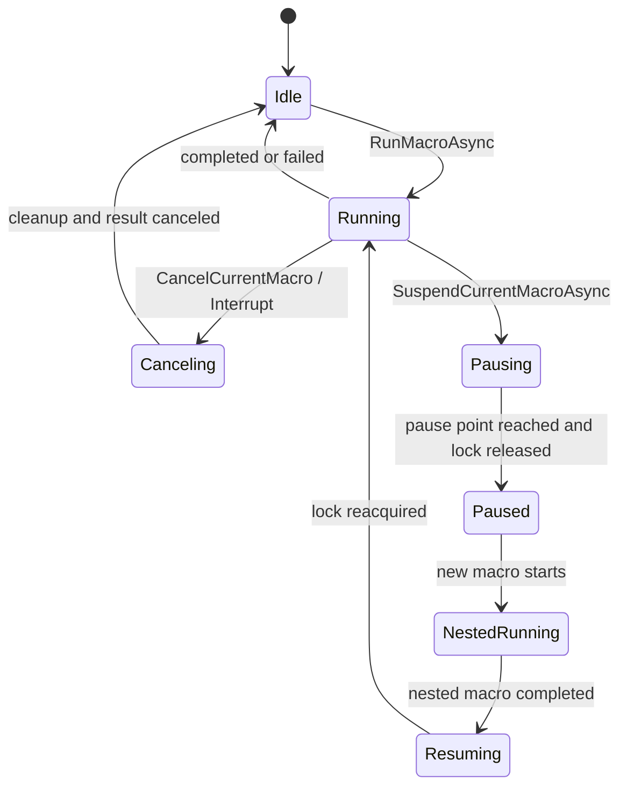

壊れやすい点:
- `SemaphoreSlim` と `MacroExecutionSession.LockHeld` の整合が崩れると deadlock または二重 release になる。
- 検証モードで UI ダイアログ、ファイル変更、外部コマンド実行が走ると安全性が崩れる。
- IF/ELSEIF/ELSE/ENDIF、REPEAT/ENDREPEAT、FOREACH_DROP/ENDFOREACH の入れ子は、スキップ中でも構文整合を維持する必要がある。
- `PREFIX PASSTHROUGH` はマクロ送出入力と ShortcutService の再検出を両立するため、InputExtraInfo タグの扱いが重要。

変更時の注意点: 新規 Macro Script コマンドを追加する場合は、実行モードだけでなく `TryValidateScript`、Macro Tips、スニペット挿入、SPEC、テストを更新する。ファイル I/O や OS API を触るコマンドは validateOnly の no-op 化を必ず設計する。

### 9.3 Config Lifecycle

何が読みづらいか: `AppConfig.Version` は 37 で、過去バージョンからのマイグレーションが累積している。単なる JSON DTO ではなく、実行時互換性の中心である。

なぜその構造か: ユーザー設定を `%AppData%` に永続化し、アプリ更新後も既存スロットを壊さないため、load 時に不足プロパティ、enum 不正値、行列/レイヤー数を補正する。

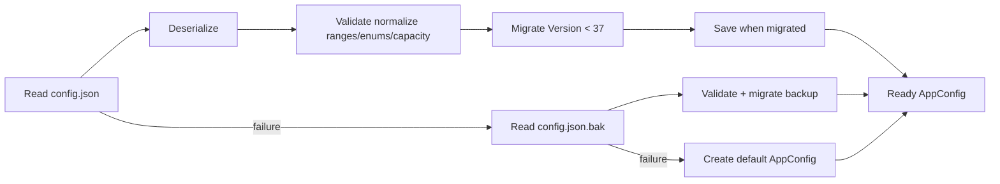

壊れやすい点:
- `AppConfig` に項目を追加しても `ConfigTransferService.ExportConfigSnapshot` に追加しないと、暗号化エクスポート/インポートで設定が欠落する。
- 行列変更時は各レイヤーの `Slots` 容量を保証しないと UI index と永続データがずれる。
- enum 追加時は不正値 fallback と既存値互換を確認する。

変更時の注意点: Config 変更は `ConfigServiceTests.cs` と `ConfigTransferServiceTests.cs` を最初に更新し、欠落検知を TDD で入れる。

### 9.4 Prefix and Shortcut State Machine

何が読みづらいか: Prefix armed、modifier residue、複数 chord partial match、特殊 Prefix コマンド、リモートセッション回避、マウスジェスチャが同じ低レベルフック上で処理される。

なぜその構造か: Windows のグローバルショートカット登録ではなく低レベルフックを使うことで、Prefix 後の独自シーケンス、入力抑止、passthrough、マウスジェスチャを同一ポリシーで制御できる。

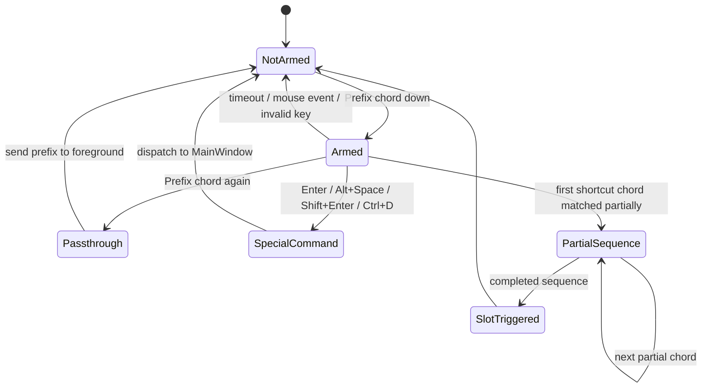

壊れやすい点:
- 抑止した keydown に対応する keyup を消費しないと、前面アプリへ片側だけ渡る。
- Prefix と同じ修飾キーを first chord に流用する residue 判定を誤ると、ユーザーが修飾キーを押し直さない操作が壊れる。
- リモートセッション中はホスト側ショートカットがゲスト入力を奪わないようにする必要がある。

変更時の注意点: ショートカット仕様は `ShortcutSequenceMatcherTests`、`ShortcutServicePrefix*Tests`、`ShortcutSpecialCommandResolverTests` を増やしてから実装する。

### 9.5 Pending Drop and DropCapture

何が読みづらいか: ファイルドロップには直接スロットへ落とす通常 Drop と、DropCaptureWindow に一度保持してから後選択する Pending Drop がある。

なぜその構造か: Explorer でドラッグ中に対象スロットを後から選びたいユースケースでは、ドラッグ中ホイールクリックや Prefix+Ctrl+D で一時ウィンドウを出し、そこでパスだけを確保する必要がある。

壊れやすい点:
- pending drop は検索レイヤーからのスロット起動でも `{args}` として消費される。
- DropCapture 表示は一時表示なので固定座標保存を上書きしてはいけない。
- Dropped インジケーターと実際の `_pendingDropPaths` がずれると、UI 表示と実行引数が不一致になる。

変更時の注意点: クリック、ショートカット、キーボード選択、検索起動の全経路で pending drop の消費条件を確認する。

### 9.6 Search Layer

何が読みづらいか: 検索結果は実スロットではなく表示スロットへ一時マッピングされる。MainWindow は `_searchResults` と `_visibleSlotMappings` を使い、見た目の index と実データの layer/slot を対応させる。

なぜその構造か: 検索レイヤーは通常のレイヤーではなく、全レイヤー横断の仮想表示である。既存スロットの並びを変更せず、表示だけを差し替えるために mapping を持つ。

壊れやすい点:
- 空スロット除外と表示枠数の関係。
- 検索呼び出し前がトレイだった場合、閉じた後にトレイへ戻す復帰コンテキスト。
- 検索中の一時配置が固定位置保存へ混ざる問題。

変更時の注意点: `SlotSearchService` は純粋テストで増やし、MainWindow 側は UI mapping と復帰挙動を確認する。

### 9.7 Window Placement

何が読みづらいか: 固定位置、マウスフォロー、カーソル画面中央、検索専用配置、キーボード/マウス別配置が混在する。

なぜその構造か: ランチャーは「常時そこにある」使い方と、「ショートカット/ジェスチャでカーソル近くに出す」使い方の両方を持つ。一時表示は便利だが、固定位置保存を汚すと次回起動が不安定になる。

壊れやすい点:
- DPI スケール変換を誤るとマルチモニターで画面外へ出る。
- NaN/Infinity やサイズ未確定のタイミングで clamp しないと復元不能になる。
- `OnLocationChanged` から保存する場合、一時配置中の suppress flag が必要。

変更時の注意点: `ScreenBoundsResolverTests` と `PlacementServiceTests` に、複数モニター/NaN/Infinity/小さい作業領域のケースを追加する。

[[↑ Back to Top]](#top)

## 10. Data Design

### 10.1 Configuration Model

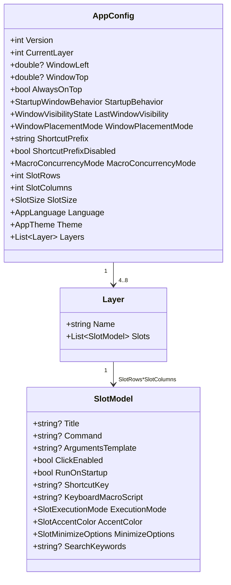

整合性制約:
- `AppConfig.Version` は現行 37。
- `Layers.Count` は 4..8。
- `SlotRows` と `SlotColumns` は 2..8。
- 各 `Layer.Slots.Count` は少なくとも `SlotRows * SlotColumns`。
- `SlotExecutionMode` は Command/MacroScript/MacroScriptExtended のいずれか。不正値やコマンド/マクロ有無と矛盾する値は `ConfigService.Validate` で補正される。
- `ArgumentsTemplate` が空の場合は `{args}` を既定にする。

### 10.2 Runtime Data and Tokens

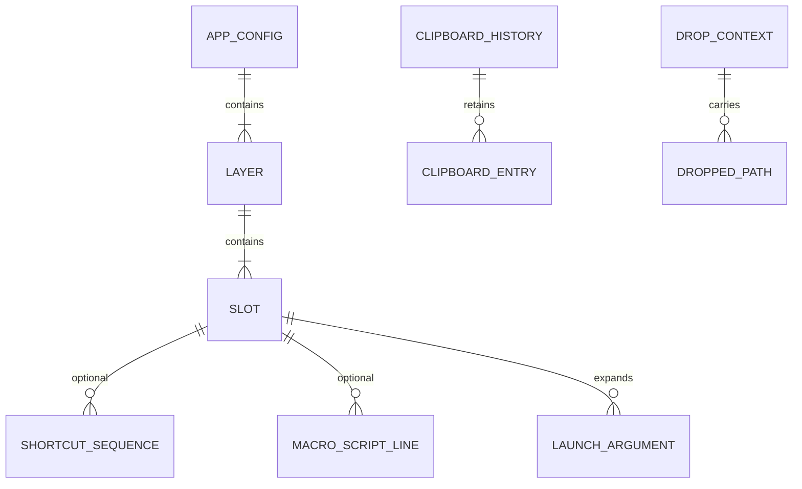

`ArgumentTemplateExpander` が扱う主な token:
- `{args}` / `{drop_args}`: ドロップ/CLI パスを空白結合し、空白を含むパスは引用する。
- `{drop_count}`: パス数。
- `{drop_path}` / `{drop_path:n}`: 先頭または 1 基点 n 番目のパス。
- `{clipboard}`: 直近クリップボード文字列。
- `{clipboard_args}` / `{clipboard_args:n}`: クリップボード履歴の行単位エントリ。上限は 20。

Macro Script では `{{VarName}}` 形式の変数展開を使う。Macro Script 拡張では `MacroExecutionContext.DroppedPaths` から `{{drop_args}}` / `{{drop_count}}` / `{{drop_path:n}}` を提供する。

### 10.3 Export Package

暗号化エクスポート payload は概念上、次の構造を持つ。

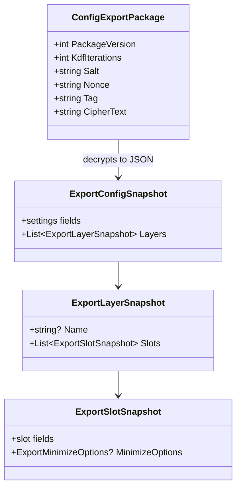

Snapshot は `AppConfig` と完全一致ではなく、転送対象として明示的に列挙された設定だけを含む。そのため設定項目追加時は snapshot 追加漏れが最重要リスクである。

[[↑ Back to Top]](#top)

## 11. Control Flow and Sequence

### 11.1 Startup and CLI

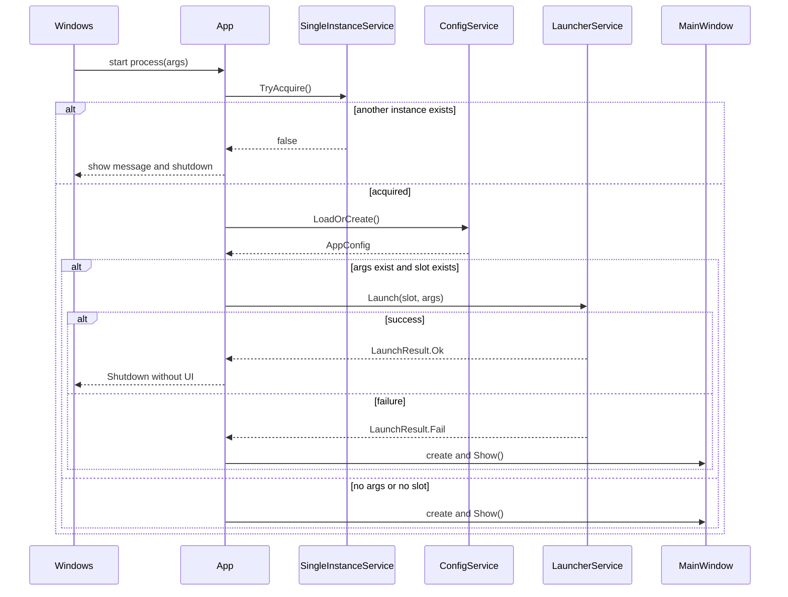

### 11.2 Slot Execution by Click, Drop, Shortcut, or Search

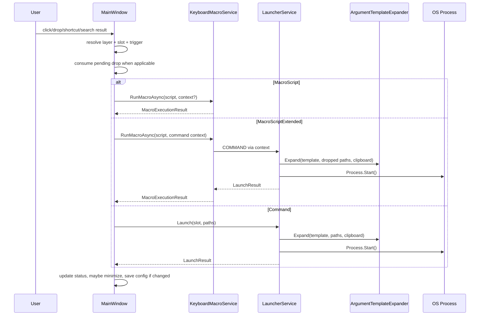

### 11.3 Prefix Shortcut

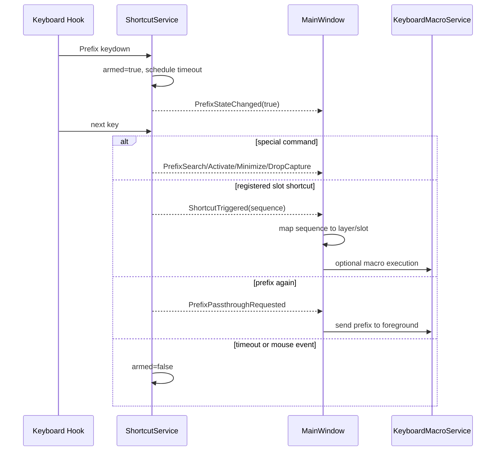

### 11.4 Config Export and Import

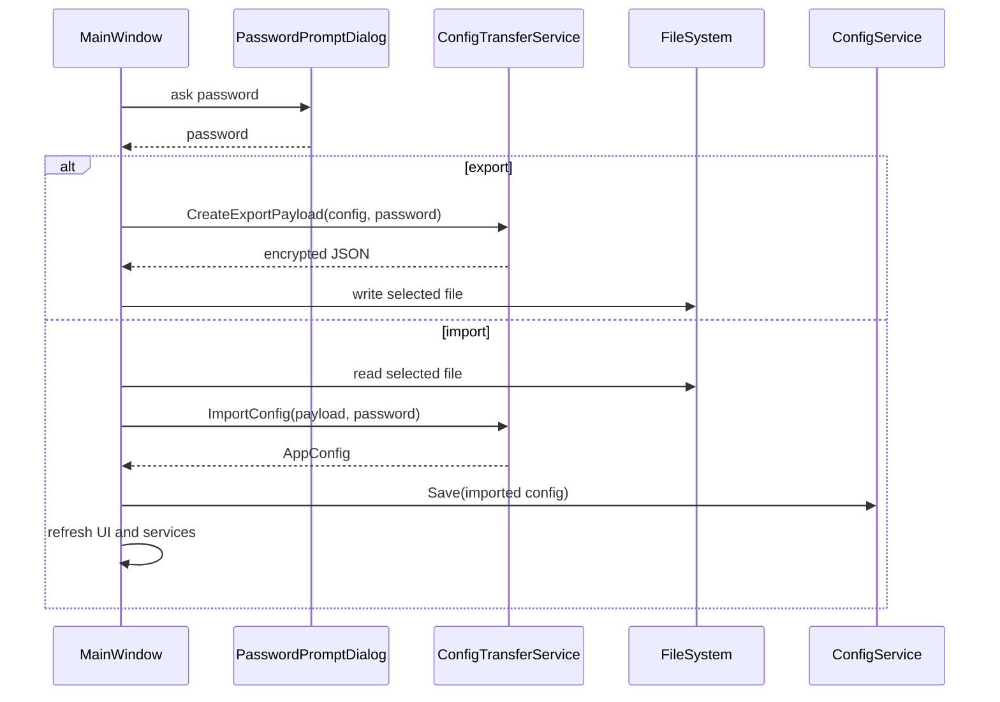

[[↑ Back to Top]](#top)

## 12. Error Handling and Resilience

エラー分類:
- 起動/設定: config 読み込み失敗、backup 復元失敗、単一インスタンス取得失敗。
- UI 操作: ダイアログ検証失敗、未登録スロット起動、ドロップデータ不正。
- プロセス起動: コマンド未設定、Process.Start 失敗、foreground promotion 失敗。
- マクロ: 構文不正、範囲外値、未知命令、SendInput 失敗、キャンセル、サスペンド失敗。
- ショートカット: hook 設置失敗、Prefix/shortcut 解析失敗、リモート/プレゼン判定失敗。
- セキュリティ境界: export/import payload 不正、パスワード誤り、暗号バージョン非対応。

リカバリ方針:
- 設定破損は `.bak`、それも失敗なら既定値へフォールバックする。
- 個別スロット起動失敗は MessageBox とログに止め、アプリ本体を継続する。
- ログ出力失敗は握りつぶし、ユーザー操作を止めない。
- Prefix 解析失敗は既定 `CTRL+Q` へフォールバックする。
- SendInput 系失敗時は入力バッファを破棄し、押下中キー/ボタンの解放を試みる。
- システム resume/session switch では ShortcutService の modifier と Prefix 状態をリセットする。

可観測性:
- `LoggerService` が `%AppData%/DropSendTo/logs/app.log` へ INFO/WARN/ERROR を出力する。
- 専用メトリクス/トレース基盤はない。診断はログと UI メッセージで行う。

[[↑ Back to Top]](#top)

## 13. Security and Operations

### 13.1 Security

- 設定エクスポートは AES-GCM と PBKDF2-SHA256 200,000 iterations を使用する。Salt/Nonce/Tag/CipherText は Base64 で JSON 化される。
- payload にはスロット登録情報、コマンド、引数テンプレート、マクロが含まれる。共有時はパスワードを別チャネルで渡し、Git/Issue 等へ password と payload を同時保存しない。
- ログにはコマンドや引数が出る可能性があるため、認証情報や PII を含むコマンドを登録する場合は注意が必要。
- Macro Script はファイル操作、入力送出、外部コマンド起動に到達できるため、信頼できない設定インポートは実行前確認が必要である。

### 13.2 Operations

- 設定: `%AppData%/DropSendTo/config.json`
- バックアップ: `%AppData%/DropSendTo/config.json.bak`
- ログ: `%AppData%/DropSendTo/logs/app.log`
- ログローテーション: 約 1MB 超で `app-yyyyMMddHHmmss.log` へ移動、7 日超を削除。
- 通常検証: Windows 側 .NET 10 SDK で `dotnet test` と `dotnet build`。
- WSL からは PowerShell 経由で Windows `dotnet` を呼ぶ。

### 13.3 Release

`scripts/Build-Release.ps1` は配布成果物を `dist/` へ出力し、`dist/latest/` へ最新コピーを展開する。Framework Dependent が既定で、`-SelfContained` と `-Portable` により追加 variant を作れる。`USER_GUIDE.md` は成果物へ同梱する。

[[↑ Back to Top]](#top)

## 14. Test Strategy

テスト方針:
- 純粋サービスは unit test を厚くする。
- Win32/WPF 依存は可能な範囲で分類ロジックを純粋化し、hook や focus を直接要求する E2E を避ける。
- UI レイアウトは XAML 定数とサービス境界をテストし、実フォーカスが必要なものは STA + Dispatcher を使う。

主要テスト対応:
- Config/転送: `ConfigServiceTests.cs`, `ConfigTransferServiceTests.cs`
- 引数展開/起動: `ArgumentTemplateExpanderTests.cs`, `LauncherServiceTests.cs`
- Macro Script: `KeyboardMacroService*Tests.cs`, `MacroConditionEvaluatorTests.cs`, `MacroQuotedTextReaderTests.cs`, `MacroRecordingOptimizerTests.cs`
- Shortcut/Prefix: `KeyChordParserPrefixTests.cs`, `ShortcutServicePrefix*Tests.cs`, `ShortcutSequenceParserTests.cs`, `ShortcutSequenceMatcherTests.cs`, `ShortcutSpecialCommandResolverTests.cs`
- 検索: `SlotSearchServiceTests.cs`
- 配置/スクリーン: `ScreenBoundsResolverTests.cs`, `PlacementServiceTests.cs`
- UI 予算: `UiLayoutBudgetTests.cs`
- スロット移動/登録: `SlotModelTests.cs`, `SlotDropRegistrationHelperTests.cs`, `SlotMinimizeOptionsTests.cs`

変更別の追加テスト指針:
- Config 項目追加: `ConfigServiceTests` で migration/normalize、`ConfigTransferServiceTests` で export/import round-trip。
- Macro command 追加: 構文検証、正常実行、異常値、validateOnly no-op、Tips/SPEC 更新確認。
- Shortcut 変更: parser、matcher、service state、特殊 command resolver を分けてテスト。
- UI レイアウト変更: `UiLayoutBudgetTests` と必要ならスクリーンショット/手動確認。

Docs-only 変更である本設計書作成では、コードテスト実行は必須ではない。検証は Markdown 構造、レビュー checklist、`git diff --check` を使う。

[[↑ Back to Top]](#top)

## 15. Trade-offs and Future Extension

### Trade-offs

- WPF + Win32 API: Windows 専用になるが、SendInput、低レベルフック、DPI/monitor、NotifyIcon との接続が明確である。
- MainWindow 統合型: UI 状態の整合を保ちやすい一方、ファイルが大きくなりやすい。純粋処理をサービスへ逃がす方針で複雑度を抑えている。
- 低レベルフック: Prefix シーケンスや入力抑止を柔軟に実現できる一方、リモートセッション、セキュリティソフト、合成入力との相性に注意が必要。
- JSON 設定 + migration: ユーザーが直接編集できる一方、設定項目追加時の snapshot/migration/test 更新漏れがリスクになる。
- ログ中心の可観測性: 導入が軽い一方、集計・メトリクス・トレースはない。

### Future Extension

- `MainWindow` の一部責務を ViewModel/Controller 的な単位へ分離し、検索、pending drop、slot execution state のテスト容易性を上げる。
- Macro Script parser を token/AST 化し、検証モードと実行モードの差分をさらに小さくする。
- Config schema の snapshot 欠落を検出する reflection-based test を追加する。
- ログの redaction helper を追加し、コマンド引数に秘密情報が混ざるリスクを下げる。
- GUI smoke test を追加し、検索レイヤー、DropCapture、モデルレスダイアログ、トレイ復帰を操作レベルで検証する。

[[↑ Back to Top]](#top)

## 16. Traceability

| Requirement / Spec | Design Area | Implementation | Tests |
|---|---|---|---|
| SP-001 UI/Window | 6, 7.2, 9.7 | `MainWindow`, `WindowPlacementService`, `ScreenBoundsResolver` | `UiLayoutBudgetTests`, `PlacementServiceTests`, `ScreenBoundsResolverTests` |
| SP-002 Slot Registration | 7.2, 7.11, 10.1 | `RegisterDialog`, `SlotModel`, `KeyChordParser` | `SlotModelTests`, `KeyChordParserPrefixTests` |
| SP-003 Layer Control | 7.2, 8 | `MainWindow`, `LayerManager` | `LayerManagerTests` |
| SP-004 Launch and Macro | 7.6, 7.7, 11.2 | `LauncherService`, `ArgumentTemplateExpander`, `KeyboardMacroService` | `LauncherServiceTests`, `ArgumentTemplateExpanderTests`, `KeyboardMacroService*Tests` |
| SP-005 Persistence | 7.4, 10.1 | `ConfigService`, `AppConfig` | `ConfigServiceTests` |
| SP-006 Menus | 7.2, 7.11 | `MainWindow`, dialogs | UI/manual plus targeted service tests |
| SP-007 Error Handling | 12 | `LoggerService`, `App`, services | `ConfigServiceTests`, launcher/macro failure tests |
| SP-008 Platform | 13.2 | `.csproj`, scripts | build/test scripts |
| SP-009 Macro Script Syntax | 9.2, 11.2 | `KeyboardMacroService`, macro helpers | `KeyboardMacroService*Tests`, `MacroConditionEvaluatorTests` |
| SP-010 Shortcut Prefix | 9.4, 11.3 | `ShortcutService`, shortcut helpers | `ShortcutServicePrefix*Tests`, `ShortcutSequence*Tests` |
| SP-011 Macro Concurrency | 9.2 | `KeyboardMacroService`, `MainWindow` macro state | macro concurrency related tests |
| SP-012 Slot Setup Mode | 7.2, 9.1 | `MainWindow` slot layout drag/drop | `SlotDropRegistrationHelperTests`, UI/manual |
| SP-013 Drag Drop Capture | 7.3, 9.5 | `DropCaptureWindow`, `MainWindow` pending drop | targeted tests/manual |

[[↑ Back to Top]](#top)

## 17. Open Questions

スコープ内の未確認事項はない。

スコープ外として追跡する候補:
- 実 GUI の自動 smoke test を Playwright 以外の Windows GUI 向け手段でどう整備するか。
- Macro Script parser の AST 化をいつ行うか。
- ログ redaction をどの粒度で導入するか。

[[↑ Back to Top]](#top)
